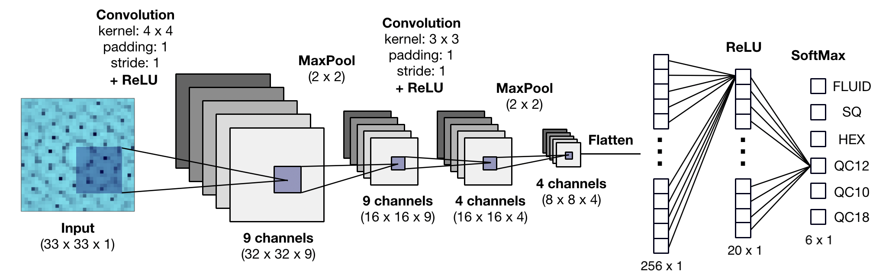

# SpectralCNN
A CNN that classifies phases of matter from their 2D diffraction patterns.

This CNN was used in Ref. 1 to evaluate the fitness function of an evolutionary strategy aimed at inverse-designing soft materials with a desired structure.

[1] [G.M. Coli, E. Boattini, L. Filion, and M. Dijkstra, *Inverse design of soft materials via a deep-learning-based evolutionary strategy*, arXiv:2106.14615 (2021).](https://arxiv.org/abs/2106.14615)
